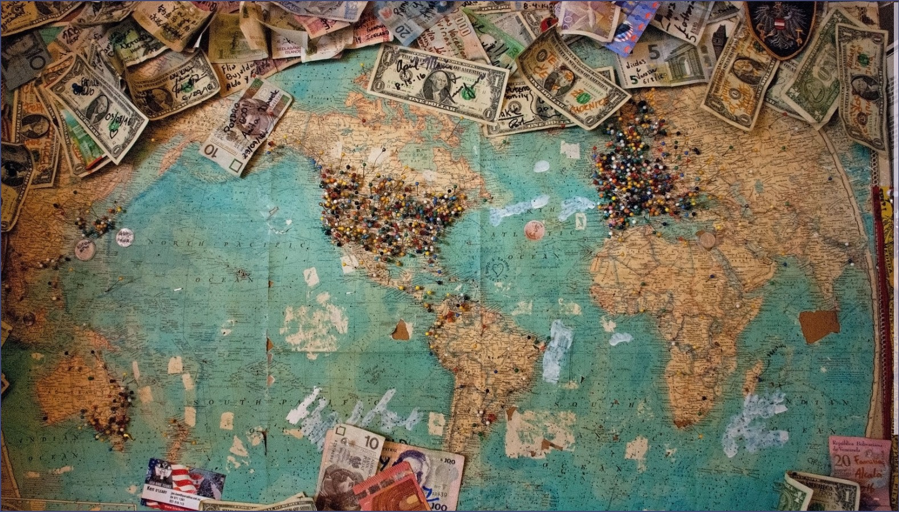

# IMAGOR

This is pet image processing editor project use React.

_Upload screen in first time load webapp_

_The screen that use almost all the time_

## Feature

Some features still in progress but already appear in this version.

### Upload panel

As the text mention in image, user can click the white box or drag file from device. 
Note1: Only **one** file each time drag to upload file. 
Note2: Currently project only support **image/jpeg**, **image/png**, **image/webp**.

_Upload box for click or drag to upload file_

Sometime you may cancel upload file. Fortunately, current version of project can detect this event so that user can upload again without reload page.

### Topbar

This bar will demonstrate all image file name separate by tag.  
On the left, this icon is temporary logo for project and may change in the future. Next to it is list of image name and hidden close icon which will appear when hover. On the right are show export menu button, show upload panel button, turn on full screen mode button, change view button and finally is open setting menu button.

Currently, only upload button and full screen button is working, other are still in progress.

_Topbar for change image and open menu_

Almost all button on the right have hotkey which is talk in [Hotkey section](img/#Hotkey).

### Toolbar

### Main screen

This is a place where image will show in first time and automatically change when slider change.

### Option bar

This is the place use can change filter of image use slider or input filter's value. 
On the top of option bar is Histogram of image which is create by image-js library. At the middle is slider box with name of slider, box to input value and slider to change value. Finally, the button in the bottom use for reset all filter.

Note1: This bar can resize when hover the area in the middle of main screen and option bar. 
Note2: This bar has a hotkey to toggle open or close which present in [Hotkey section](#Hotkey).

### Minimal option bar

This is the place to show icon of option bar with can toggle to open or close.

### Status bar

This bar show information of image. 
On the left of bar is progress bar which is not working correctly. Next to it is basic information such as image type, image size, image dimension, image model, number of channels and bit depth. On the right whill show exif information if image has.

Note1: Model of image is always RGB because browser automatically change upload image to RGB. 
Note2: Bit depth is the sum of all bit for all channels. 
Note3: Bit depth and number of channels may work wrong base on each browser.

## Hotkey

- **Ctrl + b**: Toggle option bar.
- **Ctrl + shift + f**: Show image in full screen mode.
- **Ctrl + shift + e**: Show export menu.
- **Alt + s**: Show setting menu.

## Contributing

Pull requests are welcome. For major changes, please open an issue first to discuss what you would like to change.

## License

[MIT](https://choosealicense.com/licenses/mit/)
